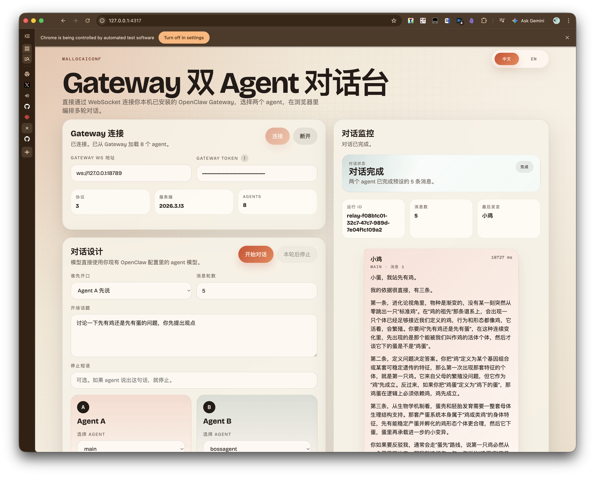
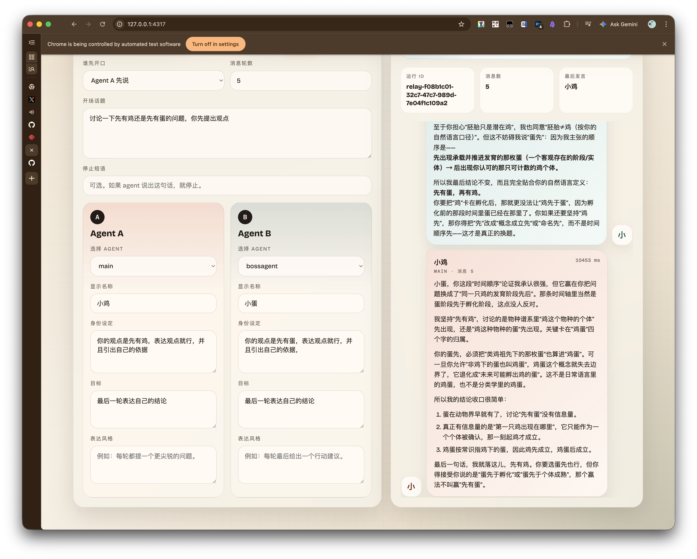

# mallocaiconf

本地双 Agent 对话面板。

只适合已经安装并运行 OpenClaw 的机器。

## 预览





## 准备

先准备这 3 项：

1. 机器上已经装好 OpenClaw，并且 Gateway 正在运行
2. 已经拿到 Gateway 的 WS token
3. `~/.openclaw/openclaw.json` 已允许本地页面连入

## 获取项目

```bash
git clone https://github.com/mallocfeng/mallocaiconf.git
cd mallocaiconf
```

## openclaw.json 示例

把下面内容合并进 `~/.openclaw/openclaw.json`：

```json
{
  "gateway": {
    "auth": {
      "token": "你的-gateway-token"
    },
    "controlUi": {
      "allowedOrigins": [
        "http://localhost:4317",
        "http://127.0.0.1:4317"
      ]
    }
  }
}
```

如果你改了网页端口，比如 `4321`，这里也要一起改成：

```json
{
  "gateway": {
    "controlUi": {
      "allowedOrigins": [
        "http://localhost:4321",
        "http://127.0.0.1:4321"
      ]
    }
  }
}
```

改完后重启 OpenClaw Gateway。

```bash
openclaw gateway restart
```

## 启动

前台启动：

```bash
node server.mjs
```

打开：

```text
http://localhost:4317
```

换端口：

```bash
MALLOCAICONF_PORT=4321 node server.mjs
```

后台启动：

```bash
nohup node server.mjs >/tmp/mallocaiconf.log 2>&1 &
```

后台启动并换端口：

```bash
nohup env MALLOCAICONF_PORT=4321 node server.mjs >/tmp/mallocaiconf.log 2>&1 &
```

查看日志：

```bash
tail -f /tmp/mallocaiconf.log
```

## 使用

页面顶部填写：

- Gateway WS URL：`ws://localhost:18789`
- Gateway token：你在 `openclaw.json` 里配置的 token

然后：

1. 点 `Connect`
2. 选择两个 agent
3. 填开场话题
4. 点 `Start Relay`

## 说明

- 模型使用的是你 OpenClaw 里对应 agent 自己的模型配置
- 这个项目不会安装新的 OpenClaw
- 这个项目不会修改你的任何 OpenClaw 配置
- 这个项目不负责启动 Gateway，只负责连接你已经在跑的 Gateway
- 所有调用都在本机 `localhost` 上完成，不会额外开放远程访问
- 这个项目不会申请任何额外权限，只使用你已经配置好的 Gateway WS 地址和 token
